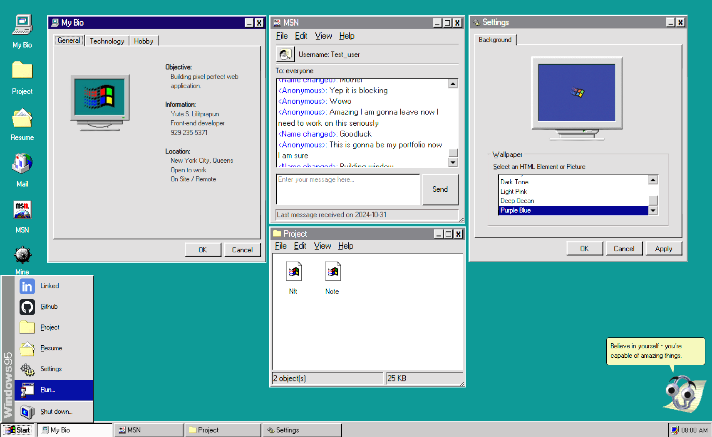
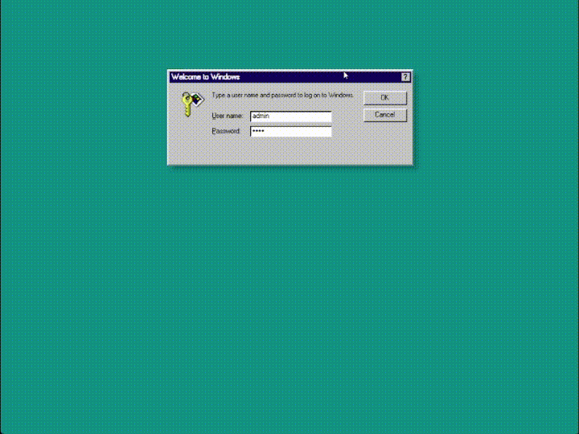
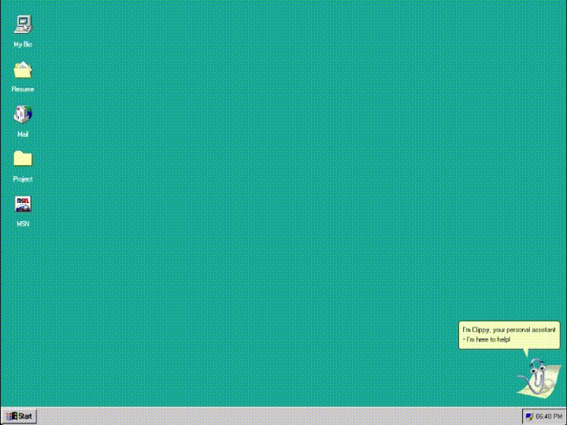
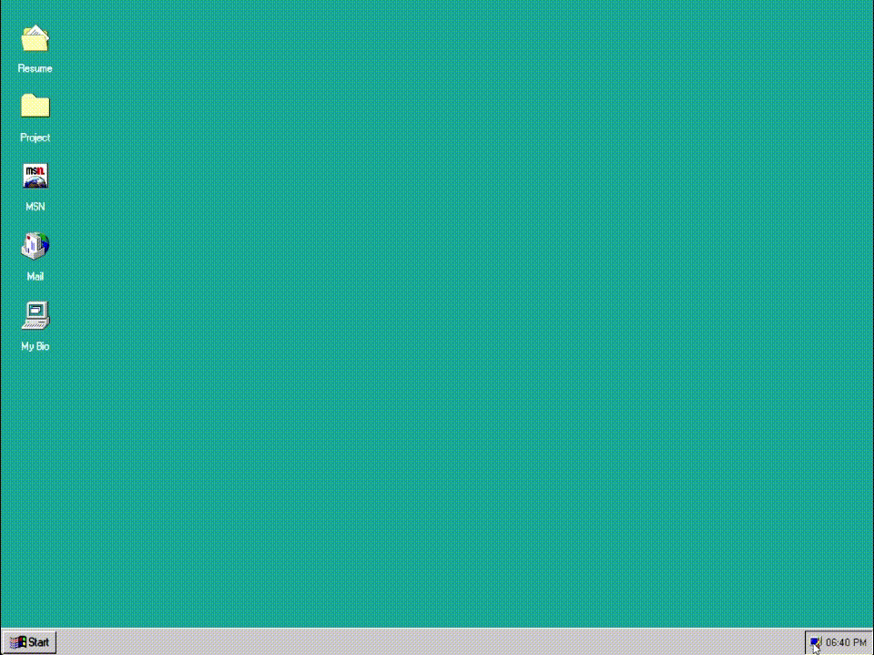
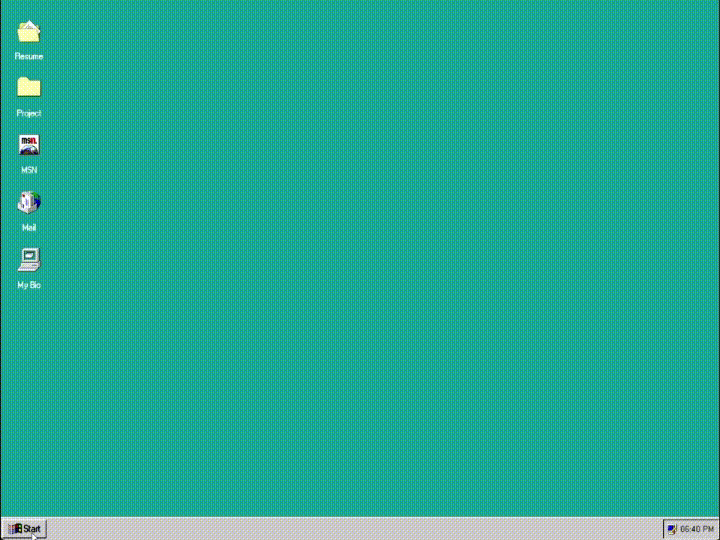
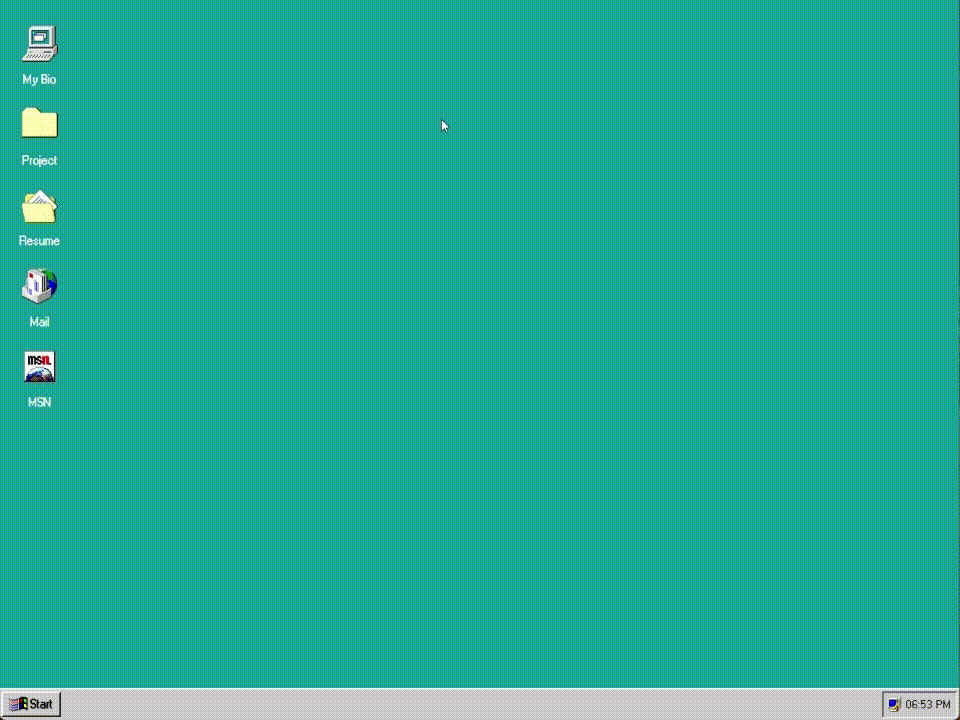
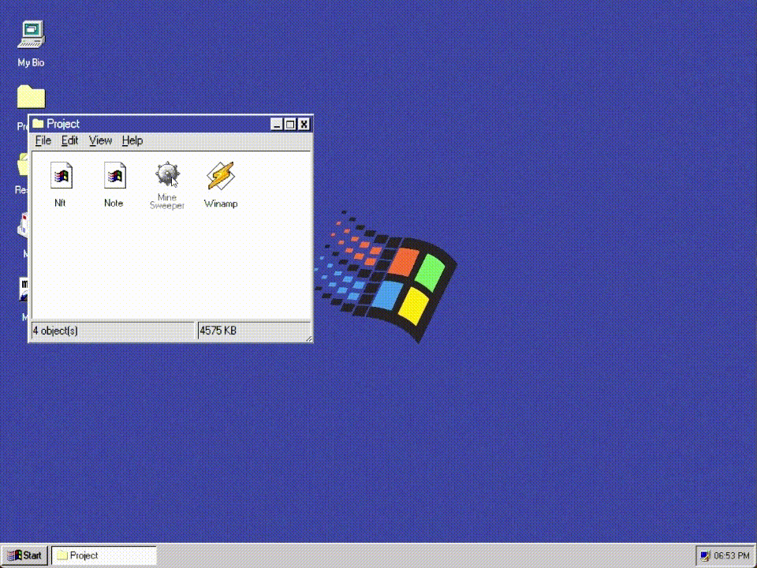
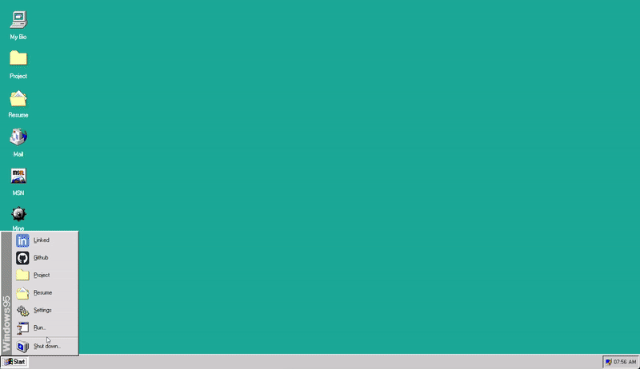

# 🖥️ Windows 95 Portfolio — Dylan Ramirez Lopez



> Un portafolio interactivo con temática **Windows 95**, construido desde cero con React.  
> Navegá por el escritorio, abrí aplicaciones, chateá en vivo, jugá Buscaminas y mucho más.  
> **Todo el crédito y autoría: [Dylan Ramirez Lopez](https://github.com/tomatitomkk)**

---

## 🚀 Demo en vivo

| Plataforma | URL |
|-----------|-----|
| **Vercel**  | [https://wins95portfolio.vercel.app](https://wins95portfolio.vercel.app) |

---

## 📸 Funcionalidades destacadas

| Función | Captura |
|---------|---------|
| Inicio de sesión |  |
| Arrastrar y soltar |  |
| Cambiar tamaño de iconos |  |
| Cambiar fondo de pantalla |  |
| Comando Ejecutar |  |
| Chat en vivo (MSN) |  |
| Notificaciones |  |
| Calendario |  |
| Buscaminas |  |
| Apagado del sistema |  |

---

## ✨ Funcionalidades completas

### Sistema operativo simulado
- Secuencia de arranque (BIOS POST → Carga del sistema → Transición glitch)
- Pantalla de inicio de sesión con animación de Mario corriendo
- Escritorio con iconos arrastrables y soltables
- Ventanas redimensionables, minimizables y expandibles
- Menú Inicio con subcarpetas estilo Windows 95
- Barra de tareas con aplicaciones abiertas
- Click derecho en escritorio e iconos (con soporte para presión larga en móvil)
- Comando **Ejecutar** (Win + R) con manejo de errores

### Aplicaciones incluidas
| App | Descripción |
|-----|-------------|
| **MSN Messenger** | Chat en vivo vía WebSocket con filtro de palabras, detección de spam, comando /nudge, y chatbot IA opcional |
| **Buscaminas** | Juego clásico con banderas en el escritorio |
| **Winamp** | Reproductor de música con Webamp |
| **Paint** | Dibujo básico integrado con [jspaint](https://github.com/1j01/jspaint) |
| **Terminal** | Símbolo del sistema con comandos funcionales |
| **Internet Explorer** | Navegador web embebido con botones Atrás/Adelante/Detener/Actualizar/Inicio |
| **Visor de imágenes** | Galería de fotos con doble clic para abrir |
| **Noticias + Clima** | Noticias en tiempo real + clima con detección de ubicación |
| **Bitcoin Tracker** | Precio BTC en vivo con gráfico (vía Coinbase WebSocket) |
| **Store** | Tienda de aplicaciones para instalar/desinstalar apps dinámicamente |
| **Tile Screen** | Pantalla de inicio estilo Windows 10/Phone |
| **Administrador de tareas** | Monitoreo de procesos activos |
| **Calendario** | Widget al hacer clic en el reloj |
| **Configuración** | Cambio de fondo, efectos visuales, color picker y modo Tile |

### Asistente Clippy
- Aparece aleatoriamente con frases motivacionales (inglés/español)
- Da consejos contextuales al abrir aplicaciones
- Animaciones variadas con 7 GIFs distintos

### Internacionalización
- Español e inglés completos
- Traducciones para todos los textos de la interfaz

### Persistencia
- Los iconos, fondo de pantalla, tamaño de iconos y configuración se guardan en `localStorage`
- Las apps instaladas/desinstaladas persisten entre sesiones

---

## 🛠️ Tecnologías utilizadas

| Tecnología | Propósito |
|-----------|-----------|
| **React 18** | Framework UI |
| **Vite 5** | Build tool y dev server |
| **Framer Motion** | Animaciones |
| **react-draggable** | Ventanas arrastrables |
| **@dnd-kit** | Drag & drop de iconos |
| **Webamp** | Reproductor Winamp en el navegador |
| **react-calendar** | Widget de calendario |
| **recharts** | Gráficos (BTC) |
| **axios** | Cliente HTTP |
| **EmailJS** | Envío de correos |
| **bad-words** | Filtro de chat |
| **WebSocket** | Chat en vivo (MSN) |
| **CSS Puro** | Estilos sin librerías de componentes |

---

## 📁 Estructura del proyecto

```
wins95Portfolio/
├── public/               # Archivos estáticos (PDFs, BIOS, WASM)
│   ├── bios/             # BIOS para emulador
│   └── resume/           # Currículums en PDF (ES/EN)
├── src/
│   ├── assets/           # Imágenes, fuentes, audios (194 archivos)
│   ├── components/       # 39 componentes React
│   │   └── boot/         # Secuencia de arranque (BIOS → Loading → Glitch)
│   ├── context/          # Context API global
│   ├── data/             # Datos estáticos (iconos, malas palabras, patch notes)
│   ├── i18n/             # Internacionalización (EN/ES)
│   ├── styles/           # 30 hojas de estilo por componente
│   └── utils/            # Funciones auxiliares
├── .env                  # Variables de entorno (API keys)
├── vercel.json           # Configuración de despliegue en Vercel
├── vite.config.js        # Configuración de Vite
└── start-dev.ps1         # Script para iniciar en Windows
```

---

## 🔧 Instalación y uso local

### Requisitos
- Node.js >= 18
- npm

### Pasos

```bash
# 1. Clonar el repositorio
git clone https://github.com/tomatitomkk/wins95Portfolio.git
cd wins95Portfolio

# 2. Instalar dependencias
npm install

# 3. Configurar variables de entorno
cp .env.example .env
# Editar .env y agregar tu VITE_DEEPSEEK_API_KEY

# 4. Iniciar servidor de desarrollo
npm run dev
```

El servidor se abrirá en `http://localhost:5173`.

### Comandos útiles

```bash
npm run dev       # Servidor de desarrollo
npm run build     # Build de producción
npm run preview   # Previsualizar build
npm run lint      # Linter ESLint
```

---

## 🌐 Despliegue en Vercel

Este proyecto está configurado para desplegarse en **Vercel**:

1. Conectá tu repositorio de GitHub a [Vercel](https://vercel.com)
2. Vercel detectará automáticamente la configuración de `vercel.json`
3. Configurá las **Environment Variables** en Vercel:
   - `VITE_DEEPSEEK_API_KEY` → Tu API key de DeepSeek
4. Cada push a `main` se despliega automáticamente

> ⚠️ **NUNCA** subas tu archivo `.env` al repositorio. Las variables de entorno sensibles deben configurarse directamente en el panel de Vercel.

---

## 👨‍💻 Autor

**Dylan Ramirez Lopez**  
[GitHub](https://github.com/tomatitomkk)

---

## ©️ Créditos

- **Creado por**: Dylan Ramirez Lopez
- **Inspiración**: Windows 95™ — Microsoft Corporation
- **Iconos**: [Old Windows Icons](https://oldwindowsicons.tumblr.com/tagged/windows%2095)
- **Paint integrado**: [jspaint](https://github.com/1j01/jspaint)
- **Winamp**: [Webamp](https://webamp.org/)

> Si hacés fork de este proyecto, por favor **dá crédito** al autor original.
